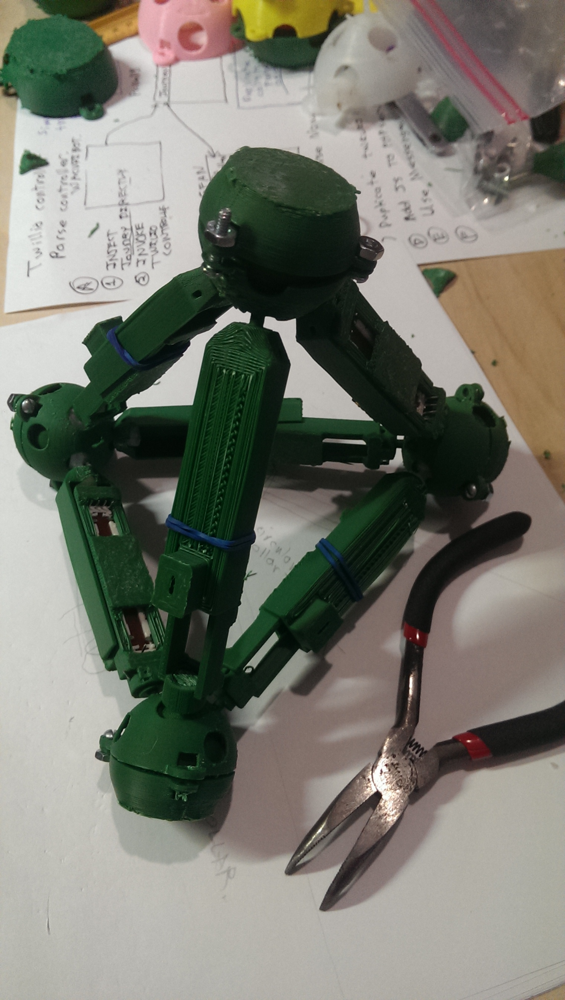

# GlussCon

This is a project of Public Invention in support of [The Gluss Project](http://pubinv.github.io/gluss/), a radical approach to robotics trying
to build a general purpose metamorphic machine. Like all Public Invention projects, it is completely open-source and does not seek patents.

The Gluss Controller, or GlussCon, explores the possibility of building a hand-manipulable controller which is a puppet or doll--a miniature version of
the larger GlussBot which is to be controlled.  By pushing the GlussCon into position with the hands, the GlussBot can be instructed to assume the same
configuration (but on a large scale.)  The hope is that in this way a work person can easily control the GlussBot in doing tasks that would otherwise
be difficult to specify.

The GlussCon project is led by Evan Bartilson and Joshua Hannan, with input from Robert L. Read.

# Approach So Far

The GlussCon project is just beginning.  The team is currently exploring the possibility of encasing a linear potentiometer in a 3D printed enclosure
to form a connector.  An Arduino will be used to read the the resitance (and hence the amount of contraction or expansion of the connector) of the
linear potentiometer.  The connectors will join to the turret joints produced at an appropriate scale to produce a network of tetrahedra
corresponding precisely in shape (but in miniature) to a GlussBot geometry.  The current position will be transmitted via Bluetooth of WIFI to
the computer controller the GlussBot.

At present, we have purchased Linear Potentiometers, practices reading their values, and designed and printed a moving enclosure. Basically
we have a single Tetrahedron almost ready:

# Plans

We intend to use a MUX chip controlled by an Arduino to read the positions of the potentiometers. We will likely use
either an Arduino or a Raspberry Pi as the controller to transmit data via WIFI.

Our hope is to keep the GlussCon independent of the GlussBot, even though its main purpose is to controll the GlussBot.
For example, we (and you, the hobbyist who wants to duplicate our open-source work) may implement a "fader box"
or an equalizer with the same technology. (Those application don't require the "glussy" geometry.0

# How to Contribute

We welcome your participation, in either the GlussCon project, the Gluss project, or one of the other Public Invention projects.
To discuss the GlussCon project specifically, email Joshua Hannan 
<hannanjoshua19@gmail.com> (Github: [joshuahannah](https://github.com/joshuahannan)) or Evan Bartilson <ebartilson@utexas.edu>.

You are welcome to email Robert L. Read <read.robert@gmail.com> to discuss how you can help the Public Invention projects in general.

However, as a public projects, it is even better for you to comment publicly
on these projects.
You can do this by opening an ("issue")[https://github.com/PubInv/PubInv/issues] here at GitHub.  If you want to add to or improve one of the existing documents, you can do this with a "pull request".

You may wish to subscribe to our <a href="https://www.youtube.com/watch?v=1T8XSMhwKUE">YouTube Channel</a>. Since we are bound neither by the need to keep something secret due to patent restrictions imposed by Universities, nor by the formality of Academic publishing, nor by the need to maintain trade secrets, we publish informally a lot at YouTube.

